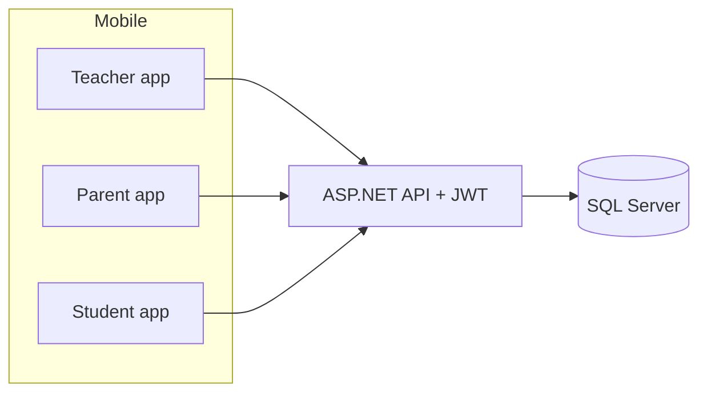

# Tài liệu demo & review — 3 role (GV · PH · HS)

> **Mục đích:** Ôn lại toàn bộ phần demo mobile/API liên quan **Giáo viên**, **Phụ huynh**, **Học sinh** — flow UI, endpoint đang gọi, bảng SQL liên quan — để review với giáo viên hướng dẫn.
> **Ngày soạn:** 15/07/2026
> **Repo:** FSchool — Flutter (`mobile/`) + ASP.NET Core 8 (`api/`) + SQL Server
> **Không nằm trong demo mobile lần này:** Admin / Trưởng bộ môn (UI quick-login đã ẩn).

**Tài liệu gốc liên quan:** [SRS.md](./SRS.md) · [API_DESIGN.md](./API_DESIGN.md) · [MOBILE_PROGRESS.md](./MOBILE_PROGRESS.md) · [tests/MOBILE_TEST_MATRIX.md](./tests/MOBILE_TEST_MATRIX.md) · [tests/MOBILE_TEST_MATRIX_NEWSFEED_LEAVE.md](./tests/MOBILE_TEST_MATRIX_NEWSFEED_LEAVE.md)

---

## 1. Bức tranh tổng thể (nói nhanh 1 phút)

Hệ thống quản lý học vụ trường phổ thông (FSchool):

| Tầng | Công nghệ |
|------|-----------|
| Mobile | Flutter + GetX, gọi API qua Dio (`ApiClient`) + JWT |
| API | ASP.NET Core 8, Clean Architecture: Controller → Service → Repository |
| DB | SQL Server, EF Core Code-First + Migrations |

**Ba role demo:**

| Role | RoleId | Việc chính trên app |
|------|--------|---------------------|
| **Teacher** | 3 | GVCN/GV dạy: điểm danh, TKB, tin lớp, duyệt đơn nghỉ, **xem** tổng kết lớp |
| **Student** | 4 | Xem TKB, điểm, bảng tin, tạo đơn nghỉ, **Học bạ** |
| **Parent** | 5 | Chọn con → xem TKB/điểm danh/điểm/đơn nghỉ/**Học bạ** của con |



---

## 2. Chi tiết bảng SQL + sơ đồ ER (phần demo)

Nhóm theo “lớp dữ liệu”. Khóa & quan hệ lấy từ EF models (`api/Models/`). Đây là khung nên ôn trước khi demo UI/API.

### 2.1. Sơ đồ ER lõi (3 role)

```mermaid
erDiagram
  Roles ||--o{ Users : has
  Departments ||--o{ Users : belongs
  AcademicYears ||--o{ Semesters : contains
  AcademicYears ||--o{ Classes : has
  Users ||--o{ Classes : homeroomTeacher
  Users ||--o{ StudentClasses : student
  Classes ||--o{ StudentClasses : class
  Users ||--o{ ParentStudents : parent
  Users ||--o{ ParentStudents : child
  Users ||--o{ TeachingAssignments : teacher
  Classes ||--o{ TeachingAssignments : class
  Subjects ||--o{ TeachingAssignments : subject
  Semesters ||--o{ TeachingAssignments : semester
  TeachingAssignments ||--o{ Timetables : schedules
  TimetableSlots ||--o{ Timetables : slot
  Timetables ||--o{ AttendanceRecords : session
  Users ||--o{ AttendanceRecords : student
  TeachingAssignments ||--o{ Assessments : has
  AssessmentTypes ||--o{ Assessments : type
  Assessments ||--o{ Grades : column
  Users ||--o{ Grades : student
  Users ||--o{ StudentSemesterSummaries : student
  Semesters ||--o{ StudentSemesterSummaries : semester
  AcademicRanks ||--o{ StudentSemesterSummaries : rank
  Users ||--o{ StudentYearlySummaries : student
  AcademicYears ||--o{ StudentYearlySummaries : year
  AcademicRanks ||--o{ StudentYearlySummaries : rank
  Users ||--o{ Announcements : author
  Announcements ||--o{ AnnouncementTargets : targets
  Classes ||--o{ AnnouncementTargets : class
  Users ||--o{ StudentRequests : student
  Users ||--o{ StudentRequests : requestedBy
  Users ||--o{ RefreshTokens : owns
```

### 2.2. Danh mục & tổ chức

| Bảng | Vai trò trong demo |
|------|-------------------|
| **Roles** | 1 Admin · 2 HeadOfDept · 3 Teacher · 4 Student · 5 Parent |
| **Users** | Tài khoản đăng nhập; `PhoneNumber` unique; `PasswordHash` |
| **Departments** | Tổ chuyên môn gắn GV |
| **AcademicYears** | Niên khóa (vd. 2025-2026) |
| **Semesters** | HK thuộc năm (`AcademicYearId`) |
| **Subjects** | Môn (Toán, Văn, Anh…) |
| **AcademicRanks** | Giỏi / Khá / TB / Yếu / Kém + khoảng điểm Min–Max |
| **TimetableSlots** | Ca học (tiết) |
| **AssessmentTypes** | Loại cột điểm (miệng, 15p, HK…) |

### 2.3. Lớp – phân công – TKB

| Bảng | Cột / ý nghĩa quan trọng |
|------|---------------------------|
| **Classes** | `ClassId`, `ClassName`, `AcademicYearId`, **`HomeroomTeacherId`** (GVCN) |
| **StudentClasses** | `StudentId` ↔ `ClassId` (HS thuộc lớp nào) |
| **TeachingAssignments** | `TeacherId`, `ClassId`, `SubjectId`, `SemesterId` |
| **Timetables** | Buổi học: `TeachingAssignmentId`, `DayOfWeek`, `SlotId`, `RoomName`, `EffectiveFrom` |
| **TimetableTemplates** | (nếu dùng) mẫu TKB |

### 2.4. Quan hệ gia đình

| Bảng | Cột |
|------|-----|
| **ParentStudents** | `ParentId`, `StudentId`, `Relationship` (Cha/Mẹ…); unique (Parent, Student) |

### 2.5. Điểm danh & điểm chi tiết

| Bảng | Cột chính | Ghi chú |
|------|-----------|---------|
| **AttendanceRecords** | `TimetableId`, `StudentId`, `Status`, `Note`, `RecordedBy`, `RecordedAt` | Unique (`TimetableId`,`StudentId`) |
| **Assessments** | `TeachingAssignmentId`, `AssessmentTypeId`, `AssessmentName`, `AssessmentDate`, `MaxScore` | “Cột điểm” trong kỳ |
| **Grades** | `AssessmentId`, `StudentId`, `Score`, `Comment`, `EnteredBy` | Unique (`AssessmentId`,`StudentId`) |

### 2.6. Học bạ đã chốt (summary)

| Bảng | Cột chính | Ý nghĩa |
|------|-----------|---------|
| **StudentSemesterSummaries** | `SummaryId`, `StudentId`, `SemesterId`, **`GPA`**, **`Conduct`**, `RankId`, `EvaluatedBy`, `EvaluatedAt` | Unique (Student, Semester). Conduct: `Tốt` \| `Khá` \| `Trung Bình` \| `Yếu` |
| **StudentYearlySummaries** | `YearlySummaryId`, `StudentId`, `AcademicYearId`, **`YearlyGPA`**, **`YearlyConduct`**, `RankId`, … | Unique (Student, Year) |

```mermaid
erDiagram
  Users ||--o{ StudentClasses : student
  Classes ||--o{ StudentClasses : class
  Users ||--o{ Classes : homeroomTeacher
  Users ||--o{ ParentStudents : parent
  Users ||--o{ ParentStudents : student
  Users ||--o{ StudentSemesterSummaries : student
  Semesters ||--o{ StudentSemesterSummaries : semester
  AcademicRanks ||--o{ StudentSemesterSummaries : rank
  Users ||--o{ StudentYearlySummaries : student
  AcademicYears ||--o{ StudentYearlySummaries : year
```

**Trạng thái demo học bạ:** seed mặc định **không** đủ row summary → màn Học bạ / Tổng kết lớp thường **empty** cho đến khi PUT qua Swagger hoặc seed thêm.

### 2.7. Bảng tin

| Bảng | Cột chính |
|------|-----------|
| **Announcements** | `AuthorId`, `Title`, `Content`, `AnnouncementType`, `Priority`, `IsDeleted`, `CreatedAt` |
| **AnnouncementTargets** | `AnnouncementId`, `ClassId` (null = tin toàn trường / Global) |
| **AnnouncementReads** | `UserId`, `AnnouncementId`, `ReadAt` — unique `(UserId, AnnouncementId)`; trạng thái đã đọc per user |

> `NotificationLogs` đã **drop** (migration `DropNotificationLogs`). Mobile chỉ còn 1 feed Announcement.

### 2.8. Đơn nghỉ

| Bảng | Cột chính |
|------|-----------|
| **StudentRequests** | `StudentId`, `RequestedBy`, `LeaveDate`, `Reason`, `AttachmentUrl`, `Status`, `ReviewedBy`, `ReviewedAt`, `ReviewNote`, `CreatedAt` |

### 2.9. Auth phụ

| Bảng | Vai trò |
|------|---------|
| **RefreshTokens** | Làm mới JWT |

### 2.10. “Cây” dữ liệu seed demo (ăn khớp ER trên)

```
Năm học (AcademicYears) id=1
 └─ HK1 / HK2 (Semesters)
 └─ Lớp 10A1 (Classes)  HomeroomTeacherId = teacher01 (3)
      ├─ HS: student01, student02, student03  (StudentClasses)
      ├─ Phân công: teacher01–Toán, teacher02–Văn, teacher03–Anh (TeachingAssignments)
      └─ TKB mẫu gắn TeachingAssignment (Timetables + TimetableSlots)

parent01 ──ParentStudents──► student01
```

---

## 3. Chuẩn bị môi trường demo

1. API chạy (Swagger thường `https://localhost:7xxx` / theo `launchSettings`).
2. SQL đã `dotnet ef database update` + seed migration `SeedData`.
3. Flutter debug: Dev Quick Login hiện khi build debug.
4. Mobile trỏ đúng base URL API (emulator / máy thật).

### 3.1. Tài khoản seed (nguồn sự thật DB)

Seed: `api/Migrations/20260612042441_SeedData.cs`
**Mật khẩu chung:** `12345678`

| Username | Họ tên | SĐT (Dev Quick Login) | Role | Ghi chú quan hệ |
|----------|--------|----------------------|------|-----------------|
| `teacher01` | Phạm Minh Tuấn | `01234567890` | Teacher | **GVCN lớp 10A1**, dạy Toán |
| `student01` | Nguyễn Thành Đạt | `0364828685` | Student | Thuộc **10A1** (`StudentClasses`) |
| `parent01` | Nguyễn Văn Tâm | `0786414311` | Parent | Cha của `student01` (`ParentStudents`) |

> **Seed DEV:** chạy `api/sql/002_wipe_and_reseed_demo_3_roles.sql` (wipe + reseed, MK `12345678`). SĐT khớp `dev_login_accounts.dart`.

---

## 4. Kịch bản demo đề xuất (theo thứ tự review)

### Vòng 1 — Học sinh (~5 phút)

| # | Thao tác UI | Kỳ vọng | Module |
|---|-------------|---------|--------|
| 1 | Login `student01` | Vào trang chủ HS | Auth |
| 2 | Thông báo / feed | Thấy tin **Global** + tin lớp **10A1** | Bảng tin |
| 3 | Thao tác nhanh → Điểm danh / Điểm / TKB | Dữ liệu gắn `studentId` | Điểm danh · Điểm · TKB |
| 4 | Đơn xin nghỉ → tạo 1 đơn ngày tới | Status **Pending** | Đơn nghỉ |
| 5 | **Học bạ** → chọn năm học | Có UI; **có thể empty** nếu chưa seed summary | Học bạ |

### Vòng 2 — Phụ huynh (~5 phút)

| # | Thao tác UI | Kỳ vọng |
|---|-------------|---------|
| 1 | Login `parent01` | Home PH |
| 2 | Chọn con `student01` | Dashboard theo con |
| 3 | Điểm danh / Điểm / TKB / Đơn nghỉ | Dùng `targetStudentId` của con |
| 4 | **Học bạ** | Cùng màn `AcademicReportView` với HS, `studentId` = con |

### Vòng 3 — Giáo viên (~8 phút)

| # | Thao tác UI | Kỳ vọng |
|---|-------------|---------|
| 1 | Login `teacher01` | Home GV |
| 2 | Lớp học của tôi → điểm danh buổi | Ghi `AttendanceRecords` |
| 3 | Xem TKB giảng dạy | Lọc theo teacher |
| 4 | Đăng thông báo lớp 10A1 | HS/PH thấy trên feed |
| 5 | Duyệt đơn nghỉ (Pending) | Approve/Reject + note |
| 6 | **Tổng kết lớp** (chỉ đọc) | Danh sách HS lớp CN + trạng thái summary |

### Vòng 4 — Cross-role (nên làm)

| Story | Các role |
|-------|----------|
| GV đăng tin lớp → HS thấy | Teacher → Student |
| HS/PH gửi đơn → GV duyệt → HS/PH thấy status | Student/Parent → Teacher → Student/Parent |
| (Tuỳ chọn) Swagger PUT summary → HS mở Học bạ thấy GPA/hạnh kiểm | API → Student |

---

## 5. Ma trận tính năng × endpoint × bảng DB

Base path API: `/api/...` — mọi request (trừ login) cần header `Authorization: Bearer <accessToken>`.

### 5.1. Xác thực

| Endpoint | Ai gọi | Bảng |
|----------|--------|------|
| `POST /api/auth/login` | Cả 3 | `Users`, `RefreshTokens` |
| `POST /api/auth/refresh` | Cả 3 | `RefreshTokens` |

### 5.2. Bảng tin (Announcement — đã bỏ NotificationLog)

| Endpoint | Ai | Bảng |
|----------|-----|------|
| `GET /api/announcement/my-feed` | HS / PH / GV | `Announcements`, `AnnouncementTargets`, (+ join lớp HS/PH/GV) |
| `GET /api/announcement/by-class/{classId}` | Có auth | như trên |
| `POST /api/announcement` | GV (tin lớp) / Admin | `Announcements`, `AnnouncementTargets` |

**Phạm vi feed:**

- **Global:** `AnnouncementType = Global` (hoặc tương đương) → mọi role thấy.
- **Class:** có `AnnouncementTargets.ClassId` → chỉ người thuộc lớp đó (HS trong lớp, PH có con trong lớp, GV dạy/CN lớp).

### 5.3. Đơn xin nghỉ

| Endpoint | Ai | Bảng |
|----------|-----|------|
| `POST /api/studentrequest` | HS (self) / PH (cho con) | `StudentRequests` |
| `GET /api/studentrequest/by-student/{studentId}` | HS / PH | `StudentRequests` |
| `GET /api/studentrequest/pending/for-teacher` | GV | `StudentRequests` (+ lớp CN/dạy) |
| `PUT /api/studentrequest/{id}/review` | GV | `StudentRequests` (`Status`, `ReviewedBy`, `ReviewNote`) |

**Status điển hình:** `Pending` · `Approved` · `Rejected`
`RequestedBy` = người gửi (HS hoặc PH); `StudentId` = học sinh nghỉ.

### 5.4. Thời khóa biểu

| Endpoint (điển hình mobile) | Ai | Bảng |
|-----------------------------|-----|------|
| Weekly / by-student / by-teacher (controller Timetable*) | HS / PH / GV | `Timetables`, `TimetableSlots`, `TeachingAssignments`, `Subjects`, `Classes` |

### 5.5. Điểm danh

| Endpoint | Ai | Bảng |
|----------|-----|------|
| `GET /api/attendance/by-timetable/{timetableId}` | GV | `AttendanceRecords` |
| `POST /api/attendance/bulk` · `PUT .../bulk` | GV | `AttendanceRecords` |
| `GET /api/attendance/by-student/{studentId}` · `.../semester/{semesterId}` | HS / PH | `AttendanceRecords` |

**Status 1 ký tự:** `P` Present · `A` Absent · `L` Late (theo SRS/API).

### 5.6. Điểm số (chi tiết môn)

| Endpoint | Ai | Bảng |
|----------|-----|------|
| `GET /api/grade/by-student/{studentId}` | HS / PH | `Grades`, `Assessments`, `AssessmentTypes` |
| `GET /api/grade/transcript/{studentId}` | HS / PH | điểm + tổng hợp kỳ (tính/join) |
| `GET /api/grade/yearly-transcript/{studentId}?academicYearId=` | HS / PH **Học bạ** | `Grades` + **`StudentSemesterSummaries` / `StudentYearlySummaries`** + ranks |
| Bulk nhập điểm (nếu còn trên API) | chủ yếu Swagger / backend | `Grades` |

> Mobile đã **gỡ UI nhập điểm GV**; API grade vẫn tồn tại.

### 5.7. Học bạ / Tổng kết lớp (mới cho demo)

| Endpoint | Ai | Mục đích | Bảng |
|----------|-----|----------|------|
| `GET /api/academicyear` | HS / PH / GV | Chọn năm | `AcademicYears` |
| `GET /api/semester` · `.../by-year/{id}` | GV (board) | Chọn HK | `Semesters` |
| `GET /api/grade/yearly-transcript/{studentId}?academicYearId=` | HS / PH | Màn **Học bạ** | summaries + grades |
| `GET /api/class/by-homeroom/{teacherId}` | GV | Lớp chủ nhiệm | `Classes` |
| `GET /api/class/{classId}/summaries/semester/{semesterId}` | **GVCN** | Board kỳ | `StudentClasses` + `StudentSemesterSummaries` + `AcademicRanks` |
| `GET /api/class/{classId}/summaries/yearly/{academicYearId}` | **GVCN** | Board năm | + `StudentYearlySummaries` |
| `PUT /api/class/.../summaries/semester|yearly/...` | **GVCN (Swagger)** | Chốt sổ | upsert summaries |

**Phân quyền:** chỉ user = `Classes.HomeroomTeacherId` mới GET/PUT board lớp. Mobile GV **chỉ đọc** (không form PUT).

### 5.8. Quan hệ PH–HS & danh sách lớp

| Endpoint | Ai | Bảng |
|----------|-----|------|
| `GET /api/parentstudent/by-parent/{parentId}` · dashboard | PH | `ParentStudents`, `Users` |
| `GET /api/studentclass/by-class/{classId}` | GV | `StudentClasses`, `Users` |
| `GET /api/teachingassignment/by-teacher/{teacherId}` | GV | `TeachingAssignments` |

---

## 6. Map màn hình Flutter (file chính)

| Role | Màn / entry | File gợi ý |
|------|-------------|------------|
| Auth | Login + Dev panel | `login_view.dart`, `dev_login_accounts.dart` |
| HS | Quick actions | `quick_actions.dart` |
| HS/PH | Học bạ | `academic_report_view.dart`, `academic_report_controller.dart` |
| PH | Home + chọn con | `parent_home_view.dart` |
| GV | Home | `teacher_home_view.dart` |
| GV | Tổng kết lớp (GET) | `teacher_class_summary_view.dart`, `teacher_class_summary_controller.dart` |
| GV | Điểm danh / Lớp | `teacher_my_classes_view.dart`, `teacher_attendance_*` |
| GV | Duyệt đơn | `teacher_leave_review_view.dart` |
| GV | Đăng tin lớp | `teacher_class_announcement_view.dart` |
| Chung | Feed thông báo | announcement feed controller + notifications view |
| Chung | TKB / điểm / đơn | `timetable_view`, `student_grade_view`, `leave_request_view` |

Luồng gọi mạng: **View → Controller → `ApiClient` → `/api/...`**.

---

## 7. Luồng nghiệp vụ quan trọng (vẽ miệng với thầy)

### 7.1. Đăng nhập

```
SĐT + MK → POST /auth/login → access + refresh JWT
→ LocalStorage lưu token + userId + role
→ Router mở shell theo RoleId
```

### 7.2. Tin lớp GV → HS

```
GV POST /announcement { type Class, targetClassIds: [10A1] }
→ Announcements + AnnouncementTargets
→ HS GET /announcement/my-feed (lọc theo lớp đang học)
```

### 7.3. Đơn nghỉ

```
HS/PH POST /studentrequest (Status=Pending)
→ GV GET pending/for-teacher
→ GV PUT .../review (Approved|Rejected + note)
→ HS/PH reload list → thấy status mới
```

### 7.4. Học bạ vs Tổng kết lớp

| | Học bạ (HS/PH) | Tổng kết lớp (GV) |
|--|----------------|-------------------|
| Góc nhìn | **1 học sinh** | **Cả lớp CN** |
| API chính | `yearly-transcript` | `class/.../summaries/...` + `by-homeroom` |
| Ghi dữ liệu trên app | Không | Không (chỉ đọc); PUT = Swagger |
| Nguồn “đã chốt” | `Student*Summaries` | cùng bảng |

---

## 8. Câu hỏi thầy có thể hỏi — gợi ý trả lời ngắn

| Câu hỏi | Trả lời gọn |
|---------|-------------|
| Vì sao có 2 bảng summary? | Chốt theo **học kỳ** và theo **cả năm**; unique theo (HS, kỳ) / (HS, năm). |
| Điểm môn vs học bạ khác gì? | `Grades` = điểm từng cột/bài; Summary = sổ tổng kết GPA + hạnh kiểm + xếp loại sau khi GVCN chốt. |
| Ai được xem board lớp? | Chỉ **HomeroomTeacherId** của lớp đó (UnauthorizedAccess / Forbid). |
| NotificationLog đâu? | Đã gỡ; feed thống nhất qua `Announcement` + `my-feed`. |
| Admin demo không? | Cố ý: mobile demo tập trung 3 role nghiệp vụ học đường. |
| Học bạ trống? | Chưa seed summary; demo UI + pipeline; có thể PUT Swagger để có số. |

---

## 9. Checklist “sẵn sàng review”

- [ ] API + DB migrate/seed OK
- [ ] Login được `teacher01` / `parent01` / `student01` (đúng SĐT)
- [ ] HS: feed + TKB/điểm + tạo đơn + mở Học bạ
- [ ] PH: chọn con + các màn theo con + Học bạ
- [ ] GV: điểm danh / tin lớp / duyệt đơn / Tổng kết lớp
- [ ] Biết chỉ rõ **bảng nào** cho từng story
- [ ] Biết hạn chế: summary có thể empty; UI nhập điểm GV đã bỏ; PUT chốt ở Swagger

---

## 10. Phụ lục — ID seed hay dùng

| Thực thể | Id điển hình sau SeedData |
|----------|---------------------------|
| AcademicYear đầu | 1 |
| Class 10A1 | 1 |
| Class 10A2 | 2 |
| teacher01 | UserId **3** |
| student01 | UserId **6** |
| parent01 | UserId **12** |
| ParentStudents parent01→student01 | ParentId 12, StudentId 6 |

*(Nếu DB local insert thêm user trước, Id có thể lệch — ưu tiên tra theo `Username`.)*

---

*Tài liệu này phục vụ ôn demo / review. Khi endpoint hoặc UI đổi, cập nhật đồng bộ với `API_DESIGN.md` và `MOBILE_PROGRESS.md`.*
